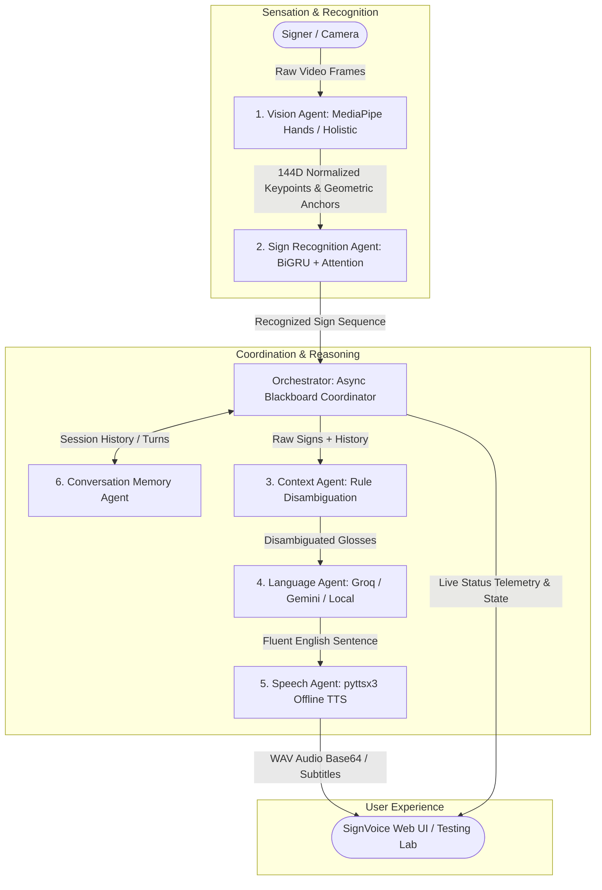

# SignVoice — Live ASL Interpreter

An end-to-end, multi-agent American Sign Language (ASL) conversation system that translates continuous sign language captured via webcam into fluent spoken English in real time.

Built with a **6-Agent Blackboard Architecture**, **BiGRU + Attention** sequence classifier, **Context Disambiguation Engine**, **Multi-Tier LLM Translation (Groq $\rightarrow$ Gemini $\rightarrow$ Local Rules)**, **Offline TTS**, **FastAPI WebSocket Streaming Backend**, and a **Modern Web UI Dashboard & Testing Lab**.

---

## System Architecture



---

## Key Features

- **6 Specialized Blackboard Agents**:
  1. **Vision Agent**: Extracts 144-dimensional feature vectors (126 hand landmarks + 18 body-relative anchor features) using MediaPipe with wrist-centric normalization and posture analysis.
  2. **Sign Recognition Agent**: 2-layer BiGRU with temporal self-attention pooling, continuous sliding-window segmentation, and geometric posture disambiguation. Supports PyTorch (`.pth`) and ONNX runtimes.
  3. **Context Agent**: Resolves homonyms and polysemous signs (e.g., `EAT` vs `FOOD`, `SHOP` vs `STORE`, `ME` $\rightarrow$ `I`/`MY`) using multi-turn conversational context and grammatical rules.
  4. **Language Agent**: Translates ASL gloss grammar to natural, fluent English using a resilient multi-tier fallback hierarchy: **Groq (`llama-3.3-70b-versatile`) $\rightarrow$ Google Gemini $\rightarrow$ Local Offline Rule Synthesizer**.
  5. **Speech Agent**: Offline text-to-speech engine powered by `pyttsx3` with base64 audio stream packaging and browser Web Speech API fallback.
  6. **Conversation Memory Agent**: Manages multi-turn session persistence, sliding context windows, and JSON transcript export.
- **Ultra-Low Latency Streaming**: Sub-300ms vision-to-sign latency and sub-second end-to-end translation pipeline over bi-directional WebSockets.
- **SignVoice Modern Interface**:
  - **Live Interpreter**: Webcam overlay with real-time hand landmark tracking, hold-to-commit sensitivity tuning (`steady`, `balanced`, `fast`), confidence/hold meters, phrase builder chips, live subtitles, audio playback toggle, and per-agent latency telemetry.
  - **Testing Lab**: Interactive sign sequence sandbox with quick presets, active token sequencing palette, 4-step pipeline inspector, and automated Ambiguity Resolution benchmark suite.
- **Fault-Tolerant & Containerized**: Graceful degradation on API outages or missing hardware, with single-command Docker deployment.

---

## Quickstart Guide

### 1. Clone & Install Dependencies
```bash
git clone https://github.com/your-username/asl-conversation-assistant.git
cd asl-conversation-assistant

# Create and activate virtual environment (optional but recommended)
python -m venv venv
venv\Scripts\activate  # Windows (or: source venv/bin/activate on Linux/macOS)

# Install Python requirements
python -m pip install -r requirements.txt
```

### 2. Configure Environment Variables (Optional)
Create a `.env` file in the root directory:
```env
GROQ_API_KEY=your_groq_api_key_here
GEMINI_API_KEY=your_gemini_api_key_here
ASL_CITIZEN_VIDEOS=E:\ASL_Citizen\ASL_Citizen\videos
```
> [!NOTE]
> If no external API keys are provided, SignVoice automatically falls back to the built-in local offline grammar synthesizer without interruption.

### 3. Launch the Application
```bash
python -m uvicorn src.api.server:app --host 0.0.0.0 --port 8000 --reload
```
Open your browser and navigate to: **`http://localhost:8000`**

---

## Dataset & Training Pipeline

The system is configured for the **[ASL Citizen](https://www.microsoft.com/en-us/research/project/asl-citizen/)** dataset by Microsoft Research (59 vocabulary classes: 39 Core + 20 Extension):

### 1. Extract Landmarks from Videos
```bash
python -m src.training.extract_landmarks --video-dir "E:\ASL_Citizen\ASL_Citizen\videos"
```

### 2. Train the BiGRU + Attention Classifier
```bash
python -m src.training.train_bigru --epochs 30 --batch-size 32 --lr 0.001
```

### 3. Export to ONNX
```bash
python -m src.training.export_onnx
```

---

## Running Tests & Benchmarks

### Run Unit & Integration Tests
```bash
python -m pytest tests/ -v -o asyncio_mode=auto
```

### Run Latency Benchmark
```bash
python tests/benchmark_latency.py
```
*SLA Budgets & Performance:*
- Vision $\rightarrow$ Sign Path: `< 300 ms` (Observed: `~7.9 ms`)
- Full End-to-End Pipeline: `< 2000 ms` (Observed: `~103 ms`)

### Run Ambiguity Resolution Benchmark
```bash
# Query the live ambiguity benchmark endpoint
python -c "import urllib.request, json; print(json.dumps(json.loads(urllib.request.urlopen('http://localhost:8000/api/benchmark/ambiguity').read()), indent=2))"
```

---

## REST & WebSocket API Reference

| Endpoint | Method | Description |
|---|---|---|
| `/` | `GET` | Serves the SignVoice web interface (Dashboard & Testing Lab) |
| `/api/agents/status` | `GET` | Real-time health, state, and latency metrics for all 6 agents |
| `/api/translate` | `POST` | Translates a raw sign gloss sequence into English text and speech audio |
| `/api/pipeline/run` | `POST` | Executes full pipeline on batch landmarks or sign tokens |
| `/api/transcript/{session_id}` | `GET` | Retrieves full JSON conversation history for a session |
| `/api/session/reset` | `POST` | Clears conversation state and memory for a session |
| `/api/benchmark/ambiguity` | `GET` | Evaluates accuracy against homonym and ambiguity test cases |
| `/ws/stream` | `WebSocket` | Bi-directional streaming for video landmarks, subtitles, and telemetry |

---

## Docker Deployment

Deploy the entire assistant in a single command:
```bash
docker-compose up --build
```
Access the application at `http://localhost:8000`.

---

## Project Structure

```
├── AGENTS.md                  # Comprehensive agent contracts and specifications
├── README.md                  # System overview and quickstart documentation
├── Dockerfile                 # Single container multi-stage build
├── docker-compose.yml         # Container configuration
├── requirements.txt           # Python dependencies
├── project.md                 # Project sprint specification and architecture
├── .gitignore                 # Excludes .csv datasets, model weights, cache & logs
├── saved_models/              # Trained PyTorch (.pth) and ONNX models (git ignored)
├── src/
│   ├── config.py              # Configuration and environment variables
│   ├── agents/
│   │   ├── base_agent.py      # Abstract agent class with timing & fallback
│   │   ├── vision_agent.py    # MediaPipe feature extraction & normalization
│   │   ├── sign_agent.py      # BiGRU inference & continuous sliding-window segmentation
│   │   ├── context_agent.py   # Rule-table disambiguator & history resolver
│   │   ├── language_agent.py  # Multi-tier LLM grammar engine (Groq/Gemini/Local)
│   │   ├── speech_agent.py    # pyttsx3 offline TTS synthesis & base64 packaging
│   │   └── memory_agent.py    # Conversation state persistence & JSON export
│   ├── models/
│   │   ├── schema.py          # Frozen ConversationState blackboard schema
│   │   └── bigru_model.py     # PyTorch BiGRU with Attention Pooling model
│   ├── orchestration/
│   │   └── coordinator.py     # Async blackboard coordinator & failure containment
│   ├── training/
│   │   ├── dataset.py         # LandmarkSequenceDataset with data augmentations
│   │   ├── extract_landmarks.py# Fast landmark extractor from dataset videos
│   │   ├── train_bigru.py     # PyTorch training pipeline with checkpointing
│   │   └── export_onnx.py     # ONNX exporter & verification helper
│   ├── data/
│   │   └── vocabulary.py      # Core 40 & Extension 20 sign vocabulary definitions
│   └── api/
│       └── server.py          # FastAPI application, WebSocket streamer & endpoints
├── static/
│   ├── index.html             # SignVoice dashboard and testing lab UI
│   ├── style.css              # Custom styling, design system, and typography
│   └── app.js                 # WebSocket client, MediaPipe tracking, telemetry UI
└── tests/
    ├── test_schema.py         # Unit tests for ConversationState
    ├── test_agents.py         # Unit tests for 6 specialized agents
    ├── test_ambiguity.py      # Ambiguity benchmark evaluation test
    ├── test_geometric.py      # Geometric and posture disambiguation tests
    ├── test_live_server.py    # Server endpoints and live integration tests
    ├── test_pipeline.py       # Integration tests & fault-tolerance tests
```

---

## Dataset Attribution & Non-Commercial Notice

> [!IMPORTANT]
> **Personal & Non-Commercial Project Notice:**
> This repository and application is an independent **personal project developed strictly for non-commercial, educational, and research purposes**. It is not intended for commercial use or deployment.

### ASL Citizen Dataset Credit
This project utilizes and builds upon the **[ASL Citizen](https://www.microsoft.com/en-us/research/project/asl-citizen/)** dataset developed by **Microsoft Research** and academic collaborators in partnership with Deaf community members. We gratefully acknowledge and credit the creators, researchers, and community signers whose contributions made this dataset possible.

### Dataset Access & Contact
- This repository **does not host, redistribute, or license** the original ASL Citizen dataset or raw video files.
- If you wish to use, download, or access the ASL Citizen dataset for research or educational purposes, please visit the official [Microsoft Research ASL Citizen Project Page](https://www.microsoft.com/en-us/research/project/asl-citizen/) to review their data use agreement, submit an access request, or contact the authors directly.

### Citation
If you use the ASL Citizen dataset in your work, please cite their NeurIPS 2023 paper:

**Text Citation:**
> Aashaka Desai, Lauren Berger, Fyodor O. Minakov, Vanessa Milan, Chinmay Singh, Kriston L. Pumphrey, Richard Ladner, Hal Daumé III, Alex Xijie Lu, Naomi Caselli, and Danielle Bragg. *"ASL Citizen: A Community-Sourced Dataset for Advancing Isolated Sign Language Recognition."* In *Thirty-seventh Conference on Neural Information Processing Systems (NeurIPS 2023) Datasets and Benchmarks Track*, 2023.

**BibTeX:**
```bibtex
@inproceedings{desai2023asl,
  title={ASL Citizen: A Community-Sourced Dataset for Advancing Isolated Sign Language Recognition},
  author={Desai, Aashaka and Berger, Lauren and Minakov, Fyodor O and Milan, Vanessa and Singh, Chinmay and Pumphrey, Kriston L and Ladner, Richard and Daum{\'e} III, Hal and Lu, Alex Xijie and Caselli, Naomi and Bragg, Danielle},
  booktitle={Thirty-seventh Conference on Neural Information Processing Systems Datasets and Benchmarks Track},
  year={2023},
  url={https://openreview.net/forum?id=V2m925rV42}
}
```
